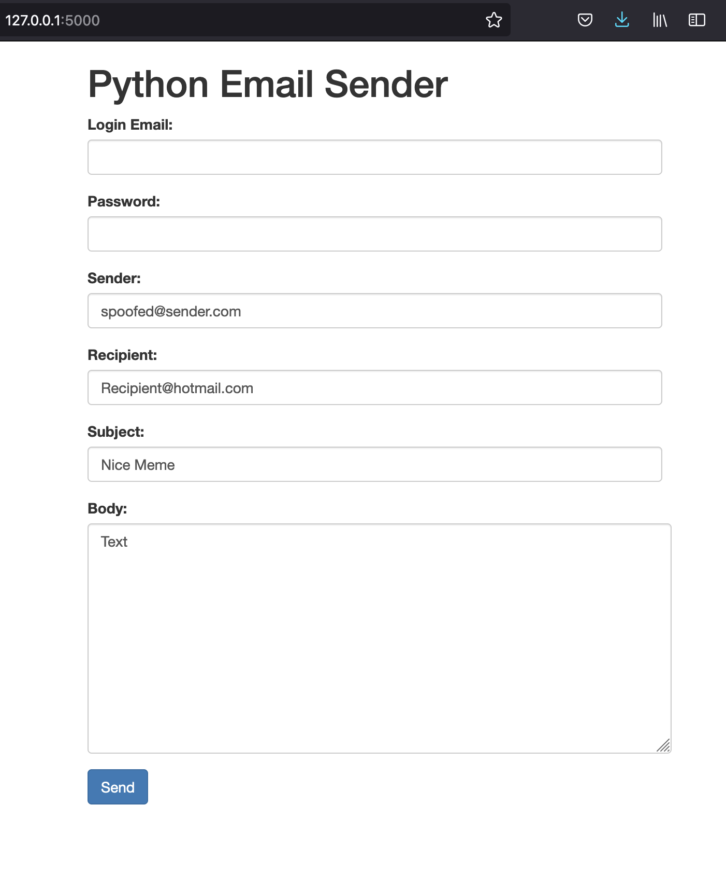

# PythonEmailSender

A python script that allows you to send an email with a web interface

This Python script is a web interface for sending an email. It uses the Flask framework to handle HTTP requests and render the HTML form for sending the email. The form allows the user to enter the recipient's email address, the subject of the email, and the email message body. When the form is submitted, the script uses the smtplib library to send the email through the user's Gmail account.

The script also uses the Jinja2 template engine to render the HTML form and the Bootstrap framework to style the form and center it on the page. The form includes basic authentication, which requires the user to enter their Gmail login email and password in order to send the email.

## Requirements

`pip install flask smtplib`

## Notes

- You will need to have a Gmail account and enable less secure apps to access your account. This can be done by going to your Google Account Security Settings and turning on "Allow less secure apps."
- Change the credentials in the script for both basic authentication of the app and the email login credentials.

Navigate to http://localhost:5000 in your web browser to access the form and send the email.
